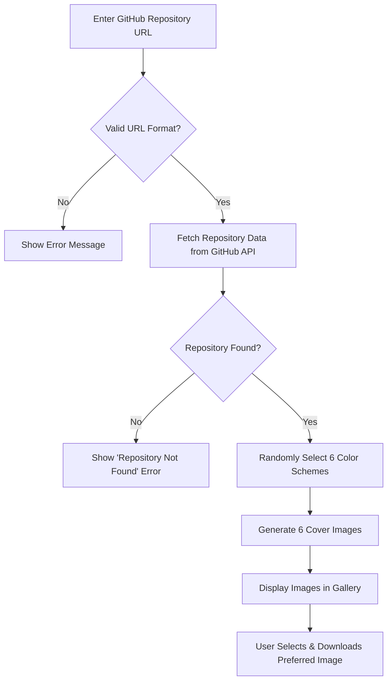
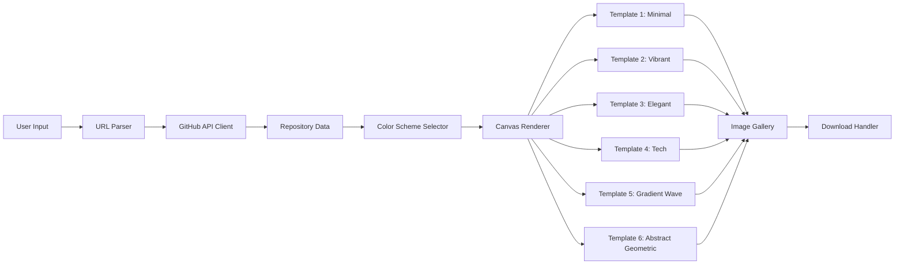

# 🎨 xsukax GitHub Social Image Generator


A powerful, privacy-focused web application that generates stunning cover images for your GitHub repositories. Create professional social media preview images with zero setup, no server requirements, and complete data privacy.

## 📖 Project Overview

The xsukax GitHub Social Image Generator is a client-side web application designed to help developers and open-source maintainers create eye-catching cover images for their GitHub repositories. By simply entering a repository URL, users can instantly generate six professionally designed cover images in different styles, each featuring the repository name, description, and owner information.

The application leverages the GitHub API to fetch repository metadata and uses HTML5 Canvas to render high-quality 1280x640 pixel images optimized for social media platforms. With over 100 unique color combinations and six distinct design templates, every generation produces fresh, vibrant results that help repositories stand out.

## 🔒 Security and Privacy Benefits

This application prioritizes user security and privacy through its architectural design and implementation:

- **100% Client-Side Processing**: All image generation occurs entirely in your browser with no server-side components, eliminating data transmission risks and ensuring complete user control
- **Zero Data Collection**: The application does not collect, store, or transmit any personal information, usage statistics, or repository data beyond the initial GitHub API request
- **No Authentication Required**: Users can generate images without creating accounts, logging in, or providing credentials, minimizing exposure of sensitive information
- **Public API Usage Only**: The application exclusively accesses publicly available repository information through GitHub's official API, respecting repository privacy settings
- **No External Dependencies**: Apart from the GitHub API, no third-party services, analytics trackers, or advertising networks are integrated, preventing data leakage
- **Local Storage Free**: The application does not utilize browser storage mechanisms (localStorage, sessionStorage, cookies), ensuring no persistent tracking
- **Open Source Transparency**: As an open-source project, the entire codebase is available for security audits and community review
- **HTTPS API Calls**: All communication with GitHub's API occurs over secure HTTPS connections, protecting data in transit
- **No Build Pipeline**: The single-file architecture eliminates supply chain attack vectors common in complex build systems

## ✨ Features and Advantages

- **Six Professional Templates**: Choose from Minimal, Vibrant, Elegant, Tech, Gradient Wave, and Abstract Geometric designs
- **100+ Color Schemes**: Each generation randomly selects from 25 carefully curated color palettes, producing unique results every time
- **Instant Generation**: Create all six cover images in seconds with a single click
- **Smart Text Sizing**: Automatic font scaling ensures repository names of any length display beautifully
- **Text Wrapping**: Long descriptions are intelligently wrapped to maintain readability
- **One-Click Download**: Download any generated image as a high-quality PNG file instantly
- **Zero Setup Required**: No installation, configuration, or dependencies needed—just open and use
- **Responsive Design**: Works seamlessly on desktop, tablet, and mobile devices
- **GitHub-Inspired UI**: Familiar interface that matches GitHub's design language
- **Keyboard Support**: Press Enter in the URL field to quickly generate images
- **Error Handling**: Clear, user-friendly error messages for invalid URLs or API issues
- **SEO Optimized Output**: Generated images are perfectly sized for GitHub social previews (1280x640)
- **Accessible Design**: High contrast ratios and readable typography ensure accessibility

## 🚀 Installation Instructions

The xsukax GitHub Social Image Generator requires no installation or build process. Follow these simple steps to get started:

### Option 1: Use Online (Recommended)

Visit the live application at your hosted URL and start generating images immediately.

### Option 2: Local Setup

1. **Clone the Repository**
   ```bash
   git clone https://github.com/xsukax/xsukax-Github-Social-Image-Generator.git
   ```

2. **Navigate to the Directory**
   ```bash
   cd xsukax-Github-Social-Image-Generator
   ```

3. **Open in Browser**
   - Simply open `index.html` in any modern web browser (Chrome, Firefox, Safari, Edge)
   - No web server required for local use

### Option 3: Deploy to GitHub Pages

1. Fork the repository to your GitHub account
2. Go to repository Settings → Pages
3. Select the main branch as the source
4. Your application will be available at `https://xsukax.github.io/xsukax-Github-Social-Image-Generator/`

### Requirements

- Modern web browser with JavaScript enabled
- Internet connection (for GitHub API access)
- No additional software or dependencies required

## 📚 Usage Guide

### Basic Workflow



### Step-by-Step Instructions

1. **Enter Repository URL**
   - Paste your GitHub repository URL into the input field
   - Supported formats:
     - Full URL: `https://github.com/owner/repo`
     - Short format: `owner/repo`
   - Press Enter or click "Generate Images"

2. **Wait for Generation**
   - The application fetches repository information from GitHub
   - Six unique images are generated with random color schemes
   - This process typically takes 1-2 seconds

3. **Review Generated Images**
   - Scroll through the gallery to view all six templates:
     - **Minimal**: Clean design with subtle background elements
     - **Vibrant**: Bold geometric shapes and vibrant accents
     - **Elegant**: Sophisticated dark theme with glowing effects
     - **Tech**: Grid-based design with monospace fonts
     - **Gradient Wave**: Dynamic flowing wave patterns
     - **Abstract Geometric**: Modern shapes with artistic composition

4. **Download Your Favorite**
   - Click the "Download Image" button under any design
   - Image saves automatically as `github-cover-{template}-{timestamp}.png`
   - Use the image as your repository's social preview

5. **Generate New Variations**
   - Click "Generate Images" again for new color combinations
   - Each generation produces fresh, unique results

### Application Architecture



### Advanced Tips

- **For Long Repository Names**: The application automatically scales font sizes to fit text properly
- **For Repositories Without Descriptions**: A default "No description available" text will be displayed
- **Color Preferences**: Keep clicking "Generate Images" until you find color combinations you love
- **Mobile Usage**: The responsive design works great on mobile devices for on-the-go generation
- **Custom Descriptions**: Edit your repository description on GitHub, then regenerate images to see the changes

### Troubleshooting

- **"Invalid GitHub URL format" error**: Ensure your URL follows the `github.com/owner/repo` pattern
- **"Repository not found" error**: Verify the repository exists and is public
- **Images not generating**: Check your internet connection and GitHub API availability
- **Download not working**: Ensure your browser allows automatic downloads

## 📄 Licensing Information

This project is licensed under the GNU General Public License v3.0.

---

**Made with ❤️ by xsukax** | [Report Issues](https://github.com/xsukax/xsukax-Github-Social-Image-Generator/issues)
